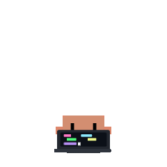
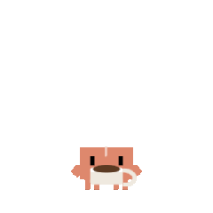
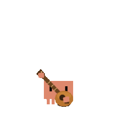
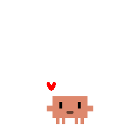
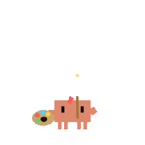
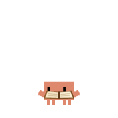
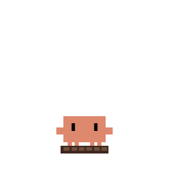
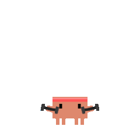
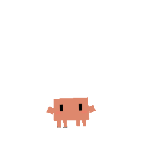

<p align="center">
  
  
  
  
</p>

<h1 align="center">ClawdPet</h1>

<p align="center">
  <strong>Your AI coding buddy, alive on a tiny screen.</strong>
</p>

<p align="center">
  <a href="https://platformio.org"></a>
  
  
  <a href="LICENSE"></a>
</p>

---

A pixel-art desk pet that lives on an **M5StickS3** and reacts to your [Claude Code](https://docs.anthropic.com/en/docs/claude-code) sessions in real time. It knows when you're coding, waiting, or done — and it celebrates with you.

<p align="center">
  
  
  
  
  
</p>

---

## Features

🐾 **Live Status Sync** — Automatically tracks all Claude Code terminals via hooks  
🎬 **16 Pixel Animations** — Random GIF pool per state, never the same twice  
📊 **3-Page Dashboard** — Pet view / Session details / Token usage  
💾 **Persistent State** — Mood, tasks, and stats survive reboots (NVS flash storage)  
🏆 **Achievements** — Unlock "HAT TRICK", "ON FIRE", "MARATHON" and more  
🎉 **Festival Surprises** — Holiday greetings on special dates  
❤️ **Mood System** — Visible mood indicator, decays when idle, recovers when coding  
👆 **Poke** — Short-press BtnA for encouragement (re-tap to switch!)  
🍔 **Feed** — Long-press BtnA to feed your pet (mood +20, eating animation)  
📳 **Shake** — Shake the device and watch your pet get dizzy  
🪟 **Multi-Window** — Aggregates all Claude Code sessions into one display  
⏱️ **Auto-Cleanup** — Stale sessions auto-removed after 90s of inactivity  

---

## How It Works

```
Claude Code ──hook──► Daemon (TCP:8787) ──serial──► M5StickS3
   events              aggregates state              renders pet + UI
```

Each Claude Code hook event (prompt submit, tool use, stop, idle) is sent to a local daemon that aggregates multi-window state and pushes it over USB serial to the device.

---

## Quick Start

### 1. Flash the firmware

```bash
# Requires PlatformIO
pio run -t upload

# Or use the helper script
tools/flash.sh
```

### 2. Configure Claude Code hooks

Add to your `~/.claude/settings.json`:

```json
{
  "hooks": {
    "UserPromptSubmit": [
      { "command": "python /path/to/ClawdPet/tools/clawdpet_hook.py" }
    ],
    "Stop": [
      { "command": "python /path/to/ClawdPet/tools/clawdpet_hook.py" }
    ],
    "SessionStart": [
      { "command": "python /path/to/ClawdPet/tools/clawdpet_hook.py" }
    ],
    "SessionEnd": [
      { "command": "python /path/to/ClawdPet/tools/clawdpet_hook.py" }
    ],
    "Notification": [
      { "matcher": "idle_prompt", "command": "python /path/to/ClawdPet/tools/clawdpet_hook.py NotificationIdle" },
      { "matcher": "choosing", "command": "python /path/to/ClawdPet/tools/clawdpet_hook.py NotificationChoosing" }
    ],
    "PostToolUse": [
      { "command": "python /path/to/ClawdPet/tools/clawdpet_hook.py" }
    ]
  }
}
```

### 3. Done!

The daemon starts automatically on first hook event. Your pet is alive.

---

## UI Layout

```
┌─────────────────┐
│ 14:30       87% │  Clock + Battery
│ W:2  D:5        │  Working / Done today
│ my-project      │  Active session names
│                 │
│   🐾 animated   │  Full-screen GIF pet
│      pet        │  (chroma-keyed, pixel art)
│                 │
│ ┌─────────────┐ │
│ │ thinking... │ │  Status bubble
│ └─────────────┘ │
└─────────────────┘
```

**BtnB** cycles pages: `Pet → Details → Tokens`  
**BtnA short-press** pokes the pet (random animation + encouragement)  
**BtnA long-press** feeds the pet (mood +20, eating animation)  
**Shake** the device → dizzy reaction (mood -5)

---

## Mood & Achievements

| Mood | Effect |
|------|--------|
| 70-100 | Normal speed, white bubble |
| 30-69 | Animation slows down (1.5x) |
| 0-29 | Very slow (2x), gray bubble: "bored..." |

| Achievement | Condition |
|-------------|-----------|
| FIRST! | Complete your first task |
| HAT TRICK | 3 tasks in one day |
| ON FIRE | 10 tasks in one day |
| STREAK x3 | 3 consecutive days |
| MARATHON | 2h+ continuous session |

---

## Hardware

- **M5Stack StickS3** — ESP32-S3, 135x240 TFT, 8MB Flash + 8MB PSRAM
- USB-C connection to your computer
- That's it. No soldering, no extra parts.

---

## Project Structure

```
ClawdPet/
├── src/main.cpp              # Firmware (rendering + protocol + mood)
├── src/anim/*.gif            # 16 embedded pixel animations
├── tools/clawdpet_daemon.py    # PC daemon (serial + TCP + state aggregation)
├── tools/clawdpet_hook.py      # Claude Code hook bridge
├── tools/clawdpet_send.py      # Manual control CLI
├── tools/task_state_manager.py  # Pure-logic state machine (testable)
├── tools/flash.sh            # One-click flash script
├── platformio.ini            # Build config
└── LEARNING.md               # Deep-dive knowledge map
```

---

## Serial Protocol

```
idle / working / choosing / done / all_done / error  → Switch state
#work name1|name2         → Active session names
#wait name1|name2         → Sessions awaiting input
#time HH:MM              → Clock sync (no RTC on device)
#tok IN=N OUT=N CACHE=N  → Token usage
#today D=5               → Daily completion count
#achv NAME               → Trigger achievement popup
#festival name           → Holiday greeting (5s)
ping                     → pong
```

---

## License

[MIT](LICENSE) — Venox
